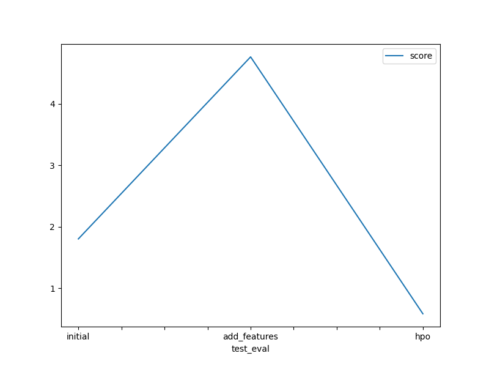

# Report: Predict Bike Sharing Demand with AutoGluon Solution
#### NAME HERE

## Initial Training
### What did you realize when you tried to submit your predictions? What changes were needed to the output of the predictor to submit your results?
To submit predictions, if the the prediction values are negative that would lead to rejection. To solve this, all negative prediction values were adjusted to zero.

### What was the top ranked model that performed?
The top ranked model that performed is the WeightedEnsemble_L3 with a Kaggle score of 0.4645.

## Exploratory data analysis and feature creation
### What did the exploratory analysis find and how did you add additional features?
TODO: Add your explanation

### How much better did your model preform after adding additional features and why do you think that is?
After implementing additional features, the model's performance significantly worsened due to some mistakes probably i have done. The Kaggle score increased (negatively) from about 1.8022 to 4.7619.

## Hyper parameter tuning
### How much better did your model preform after trying different hyper parameters?
After trying different hyper parameters, the model's performance significantly increased. The Kaggle score decreased (positively) from about 1.8022 to 0.5848.

### If you were given more time with this dataset, where do you think you would spend more time?
If i were given more time to deal with this dataset I would dive into the potential results when AutoGluon is run for a more flexible time period and more improved hyperparamter tuning and better quality preset.

### Create a table with the models you ran, the hyperparameters modified, and the kaggle score.
|model|hpo1|hpo2|hpo3|score|
|--|--|--|--|--|
|initial|default|default|default|1.8022|
|add_features|default|default|default|4.7619|
|hpo|default|default|default|0.5848|

### Create a line plot showing the top model score for the three (or more) training runs during the project.

### Create a line plot showing the top kaggle score for the three (or more) prediction submissions during the project.

## Summary
TODO: Add your explanation
